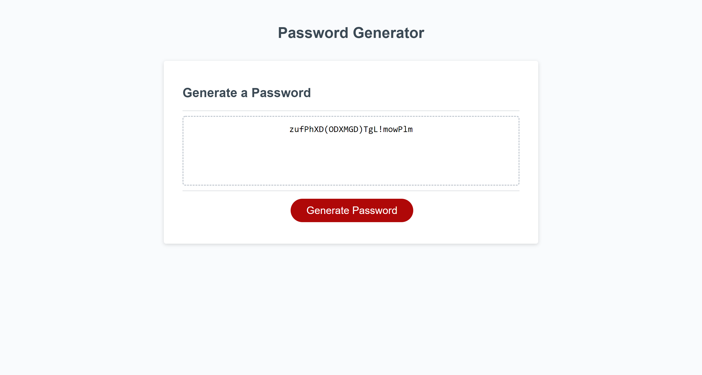

# password-generator

## Description
The goal of this project was to create a random password generator utilizing JavaScript functions.  The page accepts input from the user regarding desired parameters for their desired password, after which time the program compiles these choices and generates a password for the user. 

## Usage
Once the initial webpage is loaded, the user must click on the button that reads "Generate Password." 
Through a series of prompts, the user can input their desired length of password, and then they can choose to include uppercase letters, lowercase letters, numbers, and/or special characters.  Once these choices are made, a random password is created and posted in the display window. 
In order to start the process over, the user can once again click Generate Password.

## Installation
To view this webpage and any others I've designed, check out my GitHub repository at [Jacquie24](https://github.com/Jacquie24?tab=repositories).  

## Credits
I had a lot of help on this homework.  My classmate Pete Kriengsiri first set me on the right path with using strings.  I also spent a lot of time on [Code Academy](https://www.codecademy.com/learn) going over JavaScript. Finally today, our fearless TA Peter Colella talked me out of using a while loop where an if statement would suffice. 

## License
This page is using the [MIT](./license.txt) license.

